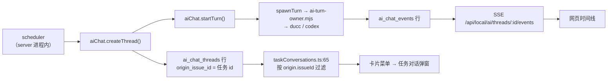
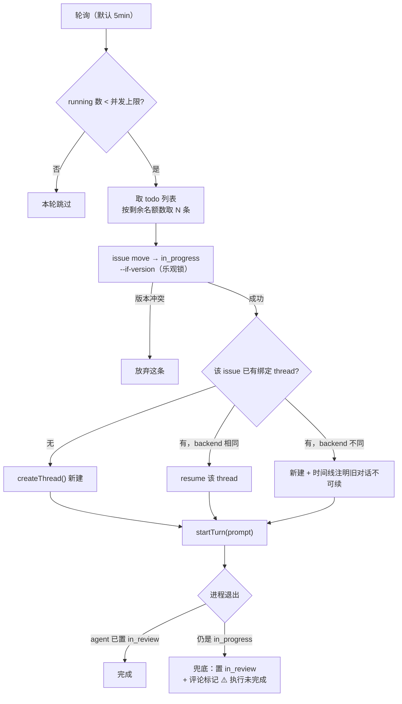

# 脱离 codex app：本地 agent 调度与多后端设计

- 日期：2026-08-13
- 状态：设计已逐节评审通过，待转实施计划
- 影响范围：`server/`、`web/src/`、`scripts/`、`shared/`、`test/`

## 1. 背景

当前项目的自动化能力寄生在 codex app 里。网页右上角的自动化设置**没有 HTTP 接口**：`web/src/App.tsx:979-1015` 通过 `postEmbeddedHostMessage({type:"taskboard:automation-request"})` 把请求抛给宿主，由 `scripts/codex-injector.mjs:913-997` 用 CDP `Runtime.evaluate` 调 `window.electronBridge.sendMessageFromView`，最终打到 `vscode://codex/<method>`。整条链路要求 codex app 正在运行。

已有一个替代脚本 `scripts/taskboard-automation-local.mjs`（52 行，codex 生成），但逻辑有四处硬伤：

| 行 | 问题 |
|---|---|
| 12 | `crypto.randomUUID()` 写在模块顶层，加载时算一次 → **所有任务共用同一个会话 id** |
| 30 | `list.tasks?.[0]` 每轮只取一条，无并发 |
| 40 | 直接 spawn codex，**完全绕过 `AiChatService`** → 没有 thread 行、没有 event 行，网页里无任何可看内容 |
| 36/41/43 | scheduler 包办认领 + 评论 + 置 `in_review`，不管 agent 是否真的做成 |

它也从不调用 `resume`，所以盖在 issue 上的 threadId 对应不到任何真实会话。

## 2. 目标

1. 后端 CLI 可选：`ducc`（默认，公司内部 Claude）或 `codex`，**全局切换，非会话级**
2. 自动化调度改为本机 npm 脚本 + server 内循环，不依赖 codex app
3. 每个任务一个独立会话
4. 网页里能查看任务对应的会话对话

## 3. 决策汇总

| # | 决策 |
|---|---|
| 1 | scheduler 跑在 taskboard server 进程内；npm 脚本只是打同一个 HTTP 接口的入口 |
| 2 | scheduler 认领（乐观锁 → `in_progress`）；agent 收尾（评论 + `in_review`）；scheduler 兜底异常退出 |
| 3 | 并发上限可配，默认 2；不做 workspace 互斥，同目录也并发 |
| 4 | 不用 worktree，不碰 git；靠 Edit 的新鲜度检查 + 派任务时避开同文件 |
| 5 | 默认后端 ducc，可切 codex，切换是**全局**的 |
| 6 | askQuestion / 工具审批 / agent 运行中插话，全部推到阶段二 |
| 7 | 看板新增一条泳道「等你回答」（共 4 条），位于「处理中」与「等你确认」之间，底层复用 `blocked` 状态 |

另有两条写进 agent prompt 的硬约束，起因是使用者经常不 commit、工作区长期是脏的：

1. **禁止 agent 做任何 git 写操作**（commit / add / stash / checkout / reset）。一个 `git add -A` 会把使用者的 WIP 一起提交
2. **评论里「改了什么」必须由 agent 自己记录，不许从 `git diff` 推导**。共享目录里混着使用者的改动和另一个 agent 的改动，`git diff` 归不到自己头上

## 4. 架构支点：scheduler 复用 AiChatService

核心改动一句话：**scheduler 不自己 spawn agent，而是调 `aiChat.createThread()` + `aiChat.startTurn()`**。

这样做之后，「每任务独立会话」和「网页能看对话」是同一个改动的两个副产品，不需要分别实现。



依赖的现成设施，全部无需改动：

| 设施 | 位置 |
|---|---|
| thread 与任务的绑定字段 | `ai_chat_threads.origin_issue_id`（`server/database.mjs:464-517`） |
| 每 thread 只允许一个活跃 run | 唯一索引 `ai_chat_runs_one_active` |
| 事件归一化 | `normalizeCodexEvent`（`server/ai-chat-process.mjs:260-333`）产出 `{kind,type,role,content,data}` |
| 进程守护 | `server/ai-turn-owner.mjs`（第 4 个 fd 控制 socket + `detached:true` + 进程组 kill） |
| 实时推送 | `server/app.mjs:1972`，广播逻辑 1985-1988 |
| 按任务筛会话 | `web/src/taskConversations.ts:65` |
| 卡片入口菜单 | `web/src/components/TaskConversationMenu.tsx`（167 行纯展示） |

## 5. 后端可插拔

### 5.1 接缝选在事件 schema

上层（DB 写入、SSE 广播、前端渲染）只认 `{kind, type, role, content, data}` 这个形状。所以换后端 = 换一套启动参数 + 换一个归一化函数，`server/ai-chat.mjs`、`server/app.mjs`、前端一行不改。

`shared/agent-backends/<id>.mjs` 统一导出：

```
{ id, resolveExecutable, buildArgs, buildPrompt, normalizeEvent, discoverCatalog }
```

现有 `buildCodexArgs`(163-218) / `buildCodexPrompt`(220-258) / `normalizeCodexEvent`(260-333) 原样搬进 `codex.mjs`，新写 `ducc.mjs`。`spawnCodexTurn`(335-471) 的进程管理骨架不动 —— 这层与后端无关。

### 5.2 能力对照

| | codex | ducc |
|---|---|---|
| 启动 | `exec --json -C <ws> -s <sandbox> -` | `-p <prompt> --output-format stream-json --verbose` |
| 会话 id | 只能事后从 `thread.started` 回读 | **`--session-id <uuid>` 可预先指定** |
| 恢复 | `resume <id>` | `--resume <id>` |
| 权限 | `-c approval_policy=...`（当前是死代码，见 9.2） | `--permission-mode` / `--tools` 白名单 |
| 模型列表 | `codex debug models`（`server/ai-chat-catalog.mjs:258-264`） | `ducc models` |
| skill 列表 | 另起 `codex app-server --stdio` 走 RPC（`ai-chat-catalog.mjs:137-218`） | **init 事件直接带 `skills` 字段** |

两处能真正简化代码：

1. `--session-id` 可预先指定 → `server/ai-chat.mjs:309-318` 那段「capture `thread.started` 并校验 id 是否匹配」的逻辑在 ducc 后端下不需要，id 就是我们生成的 `ai_chat_threads.id`
2. init 事件自带 `skills` → ducc 的 `discoverCatalog` 不用额外拉 `app-server` 子进程

实测 ducc init 事件的 keys：`agents, apiKeySource, claude_code_version, cwd, fast_mode_state, mcp_servers, model, output_style, permissionMode, plugins, session_id, skills, slash_commands, tools`。工具白名单实测生效：`--tools "Bash,AskUserQuestion,ExitPlanMode,Read"` → init 报 `tools: ['Bash','ExitPlanMode','Read','AskUserQuestion']`。

### 5.3 切换是全局的，不是会话级的

一个全局单值 `agent_backend`，取值 `ducc`（默认）或 `codex`，存 `settings` 表。配 `PATCH /api/local/ai/backend` + 前端一个切换器。

**读取发生在每次 spawn 的那一刻，不在 server 启动时缓存** —— 改完下一个任务就生效，不用重启，这是 cc-switch 的手感。

npm 脚本路径额外认环境变量 `TASKBOARD_AGENT_BACKEND` 做单次覆盖，不写库。定位与现有 `CODEX_EXECUTABLE`（`shared/codex-executable.mjs:31` 把 explicit 作为第一优先）一致。

### 5.4 thread 上仍要留一列 `backend`

这是**留痕，不是给用户选的，任何 UI 里都不出现**。原因只有一个：`codex_thread_id` 存的会话 id 是后端私有的，ducc 认不了 codex 的 id，反之亦然。恢复对话前先比这一列：

- 相同 → 正常 `--resume <id>`
- 不同 → 不能 resume，当新会话起，并在时间线插一条 activity 说明「后端已切换，此对话不能续」

不留这一列，切换后点开旧对话继续发消息就是拿无效 id 去 resume，报错难懂。

`codex_thread_id` 列名保留不改（改列名要迁移），语义扩为「后端侧会话 id」，加代码注释说明。

### 5.5 连带影响：模型列表整体更换

`ai_chat_threads` 存的 `model` / `reasoning_effort` / `sandbox` 合法取值是各后端自己的。全局切换后 catalog 重新拉一次，前端已选的模型值可能在新后端不存在 → 按「落回新后端的默认模型」处理，不报错。

### 5.6 两个 ducc 特有的坑（实测，非推测）

`ducc` 真实路径 `/home/work/.comate-server/extensions/baidu.baidu-cc-2.1.76-rc.27/resources/native-binary/bin/ducc`，是 34 行 sh 包装脚本，内层 `claude-go` 是 7.5MB 静态 ELF。

1. **`bin/ducc:3-6` 会 unset 掉 `http_proxy`/`https_proxy`/`HTTP_PROXY`/`HTTPS_PROXY`**。它自己走内网直连没事，但 agent 在任务里要访问外网（本机必须挂 `agent.baidu.com:8891`）时得自己 export，不能指望继承
2. **`bin/ducc:26-27` 每次启动都 `sed -i` 同一份 `settings.json` 和 `no-baidu-settings.json`**。并发启动会撞写 → **spawn 之间错开 500ms**。这是外部脚本的缺陷，我们改不了，只能避让

## 6. scheduler 语义



### 6.1 每任务独立会话

thread id 在 `createThread()` 里逐条生成。原脚本的 bug 是 `crypto.randomUUID()` 写在模块顶层，这个位置一挪就没了。

### 6.2 认领与收尾的分工

| 谁 | 做什么 |
|---|---|
| scheduler | `todo → in_progress`（带 `--if-version`），版本冲突即放弃这条 |
| agent | 干活 → 写评论 → `in_progress → in_review` |
| scheduler 兜底 | 进程退出后回查状态；仍在 `in_progress` → 置 `in_review` + 评论退出码与 stderr 尾部，评论开头打 `⚠️ 执行未完成` 标记 |

兜底是必须的：`in_review` 在服务端**没有任何流转校验**（`server/database.mjs:369` 只有一个管取值范围的 CHECK 约束），全靠 prompt 约定。agent 崩了、超时了、或自己判断做不了但没说，任务会永远卡在 `in_progress` 挡住名额。

**兜底不落 `blocked`，也不落回 `todo`。** 落 `todo` 会被下一轮轮询再捞起来，同一个失败任务反复重跑烧额度，且失败原因每轮被覆盖。落「等你确认」语义正确 —— 这条确实需要人看一眼。

### 6.3 并发

上限可配，默认 2。当前 running 数直接查 `SELECT COUNT(*) FROM ai_chat_runs WHERE status='running'`，不另维护计数器 —— `ai_chat_runs_one_active` 唯一索引已经保证了每 thread 至多一个活跃 run。

不做同目录互斥：两个任务落在同一代码目录也照样并发，靠 Edit 的新鲜度检查兜底 + 派任务时避开同文件。

**基线澄清**：codex 原方案是**串行**的，`shared/taskboard-automation.mjs:68` 的 prompt 写着「每次仅处理一个 todo」，cron 是 `RRULE:FREQ=MINUTELY;INTERVAL=N`（101 行）。它出现并发只是「上一轮没跑完下一轮又来了」的意外重叠，由乐观锁兜。所以「可配并发」是新增能力，不是还原。

## 7. 网页里看任务对话

### 7.1 泳道

看板从 3 条泳道变 4 条，顺序即任务的自然流向：

```
待处理(todo) → 处理中(in_progress) → 等你回答(blocked) → 等你确认(in_review)
```

「等你回答」底层**复用现有 `blocked` 状态**，不新增枚举值 —— `server/database.mjs:369` 的 CHECK 约束里 `blocked` 已在合法取值中，复用等于零迁移。代价是状态名与泳道名对不上，需在代码里注释说明。

这条泳道随阶段二的 askQuestion 落地；阶段一不会有任务进这一列。唯一的向左回退是从「等你回答」回到「处理中」。

**待核实**：现有 `blocked` 任务在看板上渲染在哪（三列都不含它，可能根本不显示）。实施前先查 `web/src/` 的列过滤逻辑：若本来不显示，加这一列是纯新增无行为改变；若混在某一列里，需先摘出来。

### 7.2 `AiChat.tsx` 必须拆

现在这个文件 2741 行，把「对话视图」和「右下角面板外壳」焊在一起。要做居中弹窗只有两条路：复制 2741 行，或者拆。拆。

```
AiChat.tsx (2741 行)
        ↓
ConversationView.tsx      ← 时间线 + 输入框 + SSE 订阅，不含任何定位/外壳
QuickChatPanel.tsx        ← 现有右下角快捷对话，内部放 ConversationView
TaskConversationModal.tsx ← 新增，居中 1100px × 85vh + 遮罩，内部放同一个 ConversationView
```

天然的拆分边界（文件内已有的内部组件，直接搬走）：`SkillReference`(547)、`MarkdownMessage`(684)、`ThinkingStepDetail`(711)、`ThinkingSteps`(750)、`EventAttachments`(858)、`MessageTimeline`(888)、`OptionMenu`(968)。

要动脑的只有主组件 `AiChat`(982) 里状态归属：`selectedThreadId` / `historyOpen` / `LAST_THREAD_KEY`(120) 这类「上次看的是哪个会话」属于快捷对话外壳，任务弹窗的 thread 由卡片决定，不需要记忆。

### 7.3 为什么不做右侧抽屉

`web/src/styles.css:6963`：

```css
.ai-chat-panel { position: fixed; right: 8px; bottom: 8px;
  width: min(672px, calc(100vw - 16px)); height: calc(100vh - 16px); }
```

现有那个「右下角面板」其实已经是右侧全高抽屉了。再做一个右侧抽屉，两个界面长得一样，分不出哪个是快捷对话哪个是任务对话。居中 + 遮罩是唯一能明确区分的形态，遮罩同时表达「聚焦在某一条任务上」。

### 7.4 什么时候能发消息

约束不是「阶段一只读」，而是**有没有活跃 run**：

| 任务状态 | 弹窗输入框 |
|---|---|
| `in_progress`（有 running run） | 禁用，只读 |
| `in_review` / 其他无活跃 run | 可发 |

`ai_chat_runs_one_active` 只禁止同 thread 有两个 running run。任务在 `in_review` 时 run 已 `completed`，没有活跃 run，发消息本来就是通的。

这不是把阶段二的东西提前。阶段二要解决的是「agent 主动提问、答案要注入一个正在阻塞的进程」，需要 stdin control 通道（未验证，见 10）。而 in_review 追加反馈是**起一个新 turn**，走现成的 `POST /api/local/ai/threads/:id/turns`（`server/app.mjs:2001`），机制不同，不依赖那个通道。

### 7.5 两条反馈路径

**路径 A：弹窗里直接说（即时）**

打开任务对话 → 输入修改意见 → `startTurn` 带 `--resume <后端会话id>` 续上原对话，agent 有全部上下文。

服务端在 `startTurn` 时做一件事：若该 thread 绑了 issue 且 issue 当前是 `in_review`，**自动置回 `in_progress`**。卡片从「等你确认」回到「处理中」，看板上直接可见它又动起来了。agent 干完照旧评论 + 置 `in_review`。

**路径 B：写评论 + 拖回待处理（攒着让 scheduler 跑）**

在卡片上写评论，拖回 `todo`。下一轮轮询捞起来，因为该 issue 已绑 thread，scheduler **resume 而非新建**，prompt 带上新增评论。适合不想现在盯着、或一次要返工多条的场景。

注意 6.2 说的「兜底不落回 `todo`」与路径 B 不矛盾：区别在于**是谁移动的**。自动移回会造成无限重跑；人手移回是明确的「再来一次」信号。

### 7.6 新写的代码

只有三处：`TaskConversationModal` 外壳、卡片菜单点进去的路由（把 threadId 传给弹窗）、「任务尚无会话」的空态。

「网页看不了 session 对话」这个问题的根因从来不是缺查看器，而是原脚本第 40 行直接 spawn 了 codex 绕过 `AiChatService`，压根没有 thread 行和 event 行可看。

## 8. 配置与 schema

### 8.1 schema 改动，全部走 ADD COLUMN

| 改动 | 内容 |
|---|---|
| 新表 `settings` | `key TEXT PRIMARY KEY, value TEXT, updated_at TEXT` |
| `ai_chat_threads` 加列 | `backend TEXT`（留痕，判断能否 resume） |
| `projects` 加列 | `automation_options TEXT`（JSON） |

**没有任何 CHECK 约束变更**，这是刻意的：SQLite 改 CHECK 要建新表拷数据。`server/database.mjs:539-546` 已有同样手法的 ADD COLUMN 迁移可参照。

### 8.2 全局配置项

存 `settings` 表：

```
agent_backend         → "ducc" | "codex"，默认 ducc
scheduler_concurrency → 默认 2
scheduler_interval_ms → 默认 300000
```

环境变量 `TASKBOARD_AGENT_BACKEND` / `TASKBOARD_CONCURRENCY` 可临时覆盖单次进程，不写库。

### 8.3 自动化配置需要一个真正的 HTTP 接口

新增 `GET/PATCH /api/projects/:id/automation`，落 `projects.automation_options`，取代 §1 描述的 host message + CDP 链路。

前端 `web/src/components/ProjectAutomationMenu.tsx`（307 行纯展示）props 不变，只把 `onChange` 从发 host message 改成 fetch。

字段调整：`DEFAULT_OPTIONS`(44-50) 里的 `quotaAware` 依赖 codex app 提供额度信息，脱离 app 后没有实现依托 → **删掉**。`model` 默认值 `"gpt-5.5"` 是 codex 的模型名，后端默认改 ducc 后要跟 catalog 走，不写死。

### 8.4 要删的 codex 耦合

| 位置 | 现在干什么 | 处置 |
|---|---|---|
| `server/app.mjs:1041-1091` | 读 `.codex-global-state.json` / `thread-project-assignments` / `chat_processes.json` 猜 workspace | 删，workspace 直接用 `projects.workspace_path` |
| `server/app.mjs:1147-1291` | `discoverSkills`/`discoverMcpServers`，服务 `/api/workflow-capabilities`(2056-2082) | 收进 backend adapter 的 `discoverCatalog` |
| `server/app.mjs:1535-1642` | `findCodexSession`/`readCodexSessionState`，服务 `/api/local/codex-thread-progress`(1748-1765) | 删，进度信息改由 `ai_chat_events` 提供 |
| `server/app.mjs:55-58` | `CODEX_AGENT_ACTOR` 常量 | 改为按 backend 取值 |

本次改动的量级：**集中在删耦合，不在加新东西**。真正的新代码只有 scheduler 循环、两份 backend adapter、以及 §7.6 那三处前端。

## 9. 测试

### 9.1 现有测试的风格（实查，必须跟着走）

- `npm test` = `node --test`，`test/` 下 47 个文件，无 jest / vitest / jsdom
- `npm run check` = `typecheck && build && test`
- **前端测试是「读源码文本 + 断言字符串」**：`test/ai-chat-ui.test.mjs` 开头 `readFile` 了 `App.tsx` / `AiChat.tsx` / `api.ts` / `styles.css` 再对内容断言；真正的逻辑测试只覆盖 `web/src/aiChatState.ts` 里的纯函数
- **后端测试是真集成**：`test/ai-chat-runner.test.mjs` 在 tmpdir 里起真的 `TaskboardDatabase` + `AiChatService`，用 `writeFile` + `chmod` 造**假的可执行文件**冒充 codex，配 `waitFor` 轮询断言

最后一条是好消息：**测 ducc adapter 不需要真装 ducc** —— 写个 shell 脚本按 stream-json 吐几行假事件，chmod +x，指过去即可，CI 也能跑。

### 9.2 必须有的自动化用例

| 用例 | 怎么测 |
|---|---|
| 每任务独立 thread id | 连跑 3 个 todo，断言 `ai_chat_threads` 三行 id 互不相同 —— 本次核心 bug，必须有回归 |
| 并发上限生效 | 并发设 2，投 5 个 todo，断言任一时刻 `ai_chat_runs` 中 `status='running'` ≤ 2 |
| 乐观锁抢占 | 两个 scheduler 实例同时认领同一条，断言只有一个成功 |
| 兜底落 in_review | 假可执行文件直接 `exit 1`，断言任务变 `in_review` 且评论带 `⚠️ 执行未完成` |
| backend 不同不 resume | 造 `backend='codex'` 的旧 thread，全局切 ducc，断言走新建而非 `--resume` |
| 两套 adapter | 各配假可执行文件，断言 `buildArgs` 的参数数组与 `normalizeEvent` 的归一结果 |
| in_review 追加反馈 | 无活跃 run 时 `startTurn`，断言状态自动回 `in_progress` 且带 `--resume` |

顺带说明：现有的工具审批路径是**死代码** —— `buildCodexArgs` 配了 `approval_policy=on-request`，但 `ITEM_TYPES` 白名单（`server/ai-chat-process.mjs:10-18`，7 个类型，无审批类型）会让 `normalizeCodexEvent` 在 329 行对审批事件返回 `null`。阶段二做审批时要一并修，本次不动。

### 9.3 只能手验的

- ducc 真实跑通一轮任务（假可执行文件测不了真模型行为）
- 弹窗的视觉与遮罩层级
- 全局切后端后 catalog 真的换了模型列表

### 9.4 一个明确的代价

`test/ai-chat-ui.test.mjs` 里 `chatSource`（`AiChat.tsx` 的源码文本）被引用 **46 次**。§7.2 把这个文件拆成三个后，**这 46 处断言会成片失败**。

处理方式：拆分时同步把断言按新文件重新归位 —— `ConversationView.tsx` 的断言指向新文件，外壳相关的留在 `QuickChatPanel.tsx`。**这件事在实施计划里必须单列为一个任务**，不能混在拆分任务里当附带工作，否则改到一半测试全红时分不清是拆错了还是断言没跟上。

## 10. 明确不做

### 10.1 推到阶段二

| 不做 | 原因 |
|---|---|
| askQuestion / 工具审批 | ducc 的 stdin `control_response` 回传通道未验证通过（见 11） |
| agent 运行中插话 | 依赖同一个通道 |
| 「等你回答」泳道进人 | 阶段一没有 ask，这一列会一直是空的 |

### 10.2 直接不做

| 不做 | 原因 |
|---|---|
| worktree / 任何 git 隔离 | 使用者经常不 commit，`git worktree add` 从 HEAD 建，agent 会拿到缺全部未提交改动的基线 |
| 文件锁 / workspace 互斥 | 拦不住 Bash、npm、formatter 的写入路径；锁集合无法提前声明；agent 遇到死锁没有回滚手段；真正的共享资源是 git 工作树而非单个文件 |
| 自动合并 / 冲突处理 | 上一条的必然结果，共享目录里没有分支可合 |
| 扩 `status` 枚举 | SQLite 改 CHECK 要建新表拷数据，ask 泳道复用 `blocked` 足够 |
| 改 `codex_thread_id` 列名 | 改列名要迁移，扩语义 + 注释即可 |
| 放宽 `/api/local/ai/*` 的 loopback 限制 | `server/app.mjs:250` 是有意设的安全边界，那些接口能任意执行命令，暴露到内网不合适。继续用 VSCode 的 SSH 端口转发 |
| 重做 `quotaAware` | 依赖 codex app 提供额度信息，脱离 app 后无实现依托 |
| 云端部分（wrangler / cloud worker / D1） | 与本次目标无关，一行不碰 |
| 多机 / 多用户 | 单机单用户，`ai_chat_runs_one_active` 这类 DB 级约束的前提就是单进程 |

### 10.3 保留不动（容易被误删，特别标注）

- **`scripts/codex-injector.mjs` 整条链路不删**。它有 5 个测试文件（`injector.test.mjs`、`inject.test.mjs`、`codex-cdp-pipe.test.mjs`、`injector-host-runtime.test.mjs`、`inject-fullheight-regression.test.mjs`）。本次只是让项目**不再依赖**它，保留可回退。真正要删的只有 §8.4 列的那几段
- **`server/ai-turn-owner.mjs` 的进程守护机制**（第 4 个 fd 控制 socket + `detached:true` + 进程组 kill）。与后端无关，换 ducc 照样用
- **乐观锁 `--if-version`** 全套机制
- **Tauri 打包相关**（`app:*` 那批 npm script）

## 11. 未验证的风险

**ducc 的 stdin `control_response` 回传通道。** init 事件里确实报了 `AskUserQuestion` 在 tools 数组中，但用 `--input-format stream-json` 实测一次，只吐出 SessionStart hook 事件，之后 120s 无输出。

影响面：如果该通道真的不通，阶段二不能沿用「spawn CLI」模型，需换成进程内 Agent SDK + `canUseTool`，是另一套架构。

**阶段一不依赖它** —— 这是把 askQuestion 划到阶段二的直接原因，也是本设计能独立成立的前提。

## 12. 已废弃的方案（记录，避免重提）

| 方案 | 废弃原因 |
|---|---|
| 每个会话各自选后端 | 使用者要的是 cc-switch 式的全局切换 |
| 复用右下角面板承接任务对话 | 那个面板已经是右侧全高抽屉（§7.3），两个界面无法区分 |
| 兜底落 `blocked` 状态并加 blocked 泳道 | 尽量归入现有泳道，只接受新增一条 ask 泳道 |
| 文件锁（类 MySQL 行锁） | 见 10.2 |
| git worktree 隔离 | 见 10.2 |
| scheduler 包办认领 + 评论 + `in_review` | 原脚本做法，会在 agent 没做成时也照样置 `in_review` |

